招投标辅助管理系统

软件使用文档

版本：V1.0

2025年2月

# **目** **录**

[系统概述 [5](#系统概述)](#_Toc2457) 5

[系统角色分类及功能 [6](#系统角色分类及功能)](#系统角色分类及功能)

[系统登录 [7](#系统登录-登录)](#系统登录-登录)

[职工管理 [7](#职工管理)](#职工管理)

[职工列表页面
[8](#职工列表页面1--职工列表页面)](#职工列表页面1--职工列表页面)

[新增职工 [11](#新增职工4--新增职工)](#新增职工4--新增职工)

[编辑职工信息
[13](#编辑职工信息3--编辑职工信息)](#编辑职工信息3--编辑职工信息)

[设置职工角色
[14](#设置职工角色2--职工角色设置)](#设置职工角色2--职工角色设置)

[删除职工 [15](#删除职工)](#删除职工)

[批量导入职工信息
[16](#批量导入职工信息5--导入新职工信息)](#批量导入职工信息5--导入新职工信息)

[招标项目立项 [18](#招标项目立项)](#招标项目立项)

[项目列表 [18](#项目列表-1--项目列表)](#项目列表-1--项目列表)

[新增项目 [19](#新增项目2--新增项目)](#新增项目2--新增项目)

[编辑项目信息
[20](#编辑项目信息3--编辑项目信息)](#编辑项目信息3--编辑项目信息)

[项目立项审核与分配 [21](#项目立项审核与分配)](#项目立项审核与分配)

[项目分配列表
[21](#项目分配列表1--项目分配列表)](#项目分配列表1--项目分配列表)

[分配成员到项目 [22](#分配成员到项目)](#分配成员到项目)

[标书编辑与上传审核 [23](#标书编辑与上传审核)](#标书编辑与上传审核)

[标书列表 [23](#标书列表-1--标书列表)](#标书列表-1--标书列表)

[新增项目标书
[24](#新增项目标书2--新增项目标书)](#新增项目标书2--新增项目标书)

[标书提交审核 [24](#标书提交审核)](#标书提交审核)

[标书审核 [26](#标书审核)](#标书审核)

[标书审核列表
[26](#标书审核列表1--标书审核列表)](#标书审核列表1--标书审核列表)

[审核流程 [27](#审核流程2--标书审核流程)](#审核流程2--标书审核流程)

[标书评语管理 [29](#标书评语管理)](#标书评语管理)

[评语列表
[29](#评语列表1--标书评语页面的常规维护)](#评语列表1--标书评语页面的常规维护)

[新增评语 [29](#新增评语)](#新增评语)

[编辑和删除评语 [30](#编辑和删除评语)](#编辑和删除评语)

[招标公告管理 [30](#招标公告管理)](#招标公告管理)

[招标公告列表
[30](#招标公告列表1--招标公告列表)](#招标公告列表1--招标公告列表)

[场地预约设置 [31](#场地预约设置)](#场地预约设置)

[编写招标公告 [34](#编写招标公告)](#编写招标公告)

[招标公告审核 [36](#招标公告审核)](#招标公告审核)

[审核列表
[36](#审核列表1--招标-公告审核列表)](#审核列表1--招标-公告审核列表)

[审核流程 [37](#审核流程)](#审核流程)

[开标室管理 [39](#开标室管理)](#开标室管理)

[场地列表
[39](#场地列表1--开标室的常规维护)](#场地列表1--开标室的常规维护)

[新增场地 [39](#新增场地)](#新增场地)

[编辑和删除场地 [40](#编辑和删除场地)](#编辑和删除场地)

[官网信息展示 [41](#官网信息展示)](#官网信息展示)

[首页公告列表 [41](#首页公告列表)](#首页公告列表)

[公告详情页 [41](#公告详情页)](#公告详情页)

[投标报名管理 [43](#投标报名管理)](#投标报名管理)

[投标人报名
[43](#投标人报名3--招标项目报名)](#投标人报名3--招标项目报名)

[报名信息审核 [45](#报名信息审核)](#报名信息审核)

[评标准备 [48](#评标准备)](#评标准备)

[评标准备列表 [48](#评标准备列表)](#评标准备列表)

[导入评标专家 [50](#导入评标专家)](#导入评标专家)

[设置开标基本信息 [52](#设置开标基本信息)](#设置开标基本信息)

[导出评标辅助表格 [53](#导出评标辅助表格)](#导出评标辅助表格)

[]{#_Toc2457 .anchor}

# 系统概述

招投标辅助管理系统是一款专为招标代理机构设计的信息化管理平台，旨在规范招投标业务流程，提高工作效率，实现项目全生命周期的数字化管理。

本系统主要包含以下核心功能模块：

1.  **职工管理**：录入公司职工信息，分配使用角色（总经理角色操作）

2.  **招标项目立项**：录入项目基础信息，建立项目档案（员工角色操作）

3.  **项目立项审核与分配**：项目经理审核项目并分配团队成员（项目经理角色操作）

4.  **标书编辑与上传审核**：项目组成员编制标书并提交审核（项目组长角色操作）

5.  **标书审核**：项目经理或审核人员对标书进行审核（项目经理角色操作）

6.  **标书评语管理**：维护审核评语库，便于快速标注问题（项目经理角色操作）

7.  **招标公告管理**：编辑招标公告、预约开标场地、设置费用等（员工角色操作）

8.  **招标公告审核**：项目经理审核公告内容，通过后发布（项目经理角色操作）

9.  **开标室管理**：维护开标室基本信息（项目经理角色操作）

10. **官网信息展示**：公告同步至公司官网供投标人查看

11. **投标报名管理**：投标人网上报名及报名信息审核（项目经理角色操作）

12. **评标准备**：开标前准备评标所需的各类辅助文件（员工角色操作）

# 系统角色分类及功能

根据业务需求，系统现有5个不同的角色，分别是员工、项目组长、项目经理、财务总监和总经理。每个角色完成不同的操作，相关角色以及功能详见下表。

  ------------ ------------------------------------------------------------------------------------------------------------------
  角色名称     角色功能

  员工         项目立项、公告编辑和发布、开评标数据准备

  项目组长     项目中标书的编辑

  项目经理     项目的立项审核与项目角色分配、项目标书的审核、标书评语的常规管理、招标公告审核、开标室的常规管理、投标人信息审核

  财务总监     投标人文件费审核、投标人保证金审核

  总经理       企业员工信息管理、企业用工系统角色分配
  ------------ ------------------------------------------------------------------------------------------------------------------

# 系统登录 

输入管理系统网址，可以进入系统登录页面，输入用户名、密码和验证码即可以登录。

# 职工管理

职工管理模块是招投标辅助管理系统的核心功能之一，主要用于对企业内部职工信息进行统一管理。通过该模块，用户可以实现职工信息的增删改查、角色分配、批量导入等功能，该模块必须使用总经理角色人员登录才能操作。

本模块的主要功能包括：

• 职工信息录入与管理：支持单条录入和批量导入两种方式

•
角色权限设置：可为职工分配总经理、财务总监、项目经理、项目组长、员工等角色

• 信息检索筛选：支持多条件组合查询，快速定位目标职工

• 资质证书管理：记录职工的一建、二建、一造、二造等专业资质信息

## 职工列表页面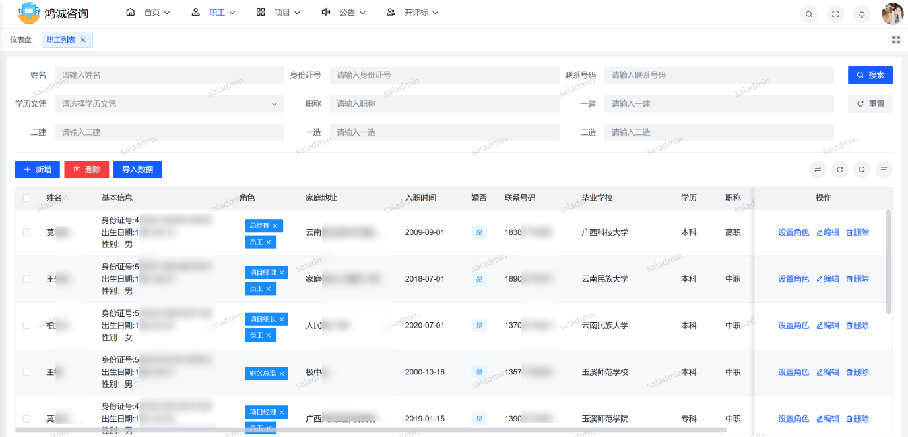

职工列表页面是职工管理的主界面，展示了系统中所有职工的基本信息，并提供各种操作入口。

## 页面布局

页面采用标准的列表布局，从上到下分为以下几个区域：

**顶部导航栏**：显示系统Logo和主要功能模块入口，包括首页、职工、项目、公告、开评标等

**搜索筛选区**：提供多个搜索条件输入框，支持按姓名、身份证号、联系号码等条件筛选

**操作按钮区**：包含新增、删除、导入数据等功能按钮

**数据列表区**：以表格形式展示职工信息，每行代表一个职工

## 数据展示

职工列表表格包含以下列信息：

  -----------------------------------------------------------------------
  **列名**              **说明**
  --------------------- -------------------------------------------------
  姓名                  职工姓名

  基本信息              包含身份证号、出生日期、性别

  角色                  职工在系统中的角色标签

  家庭地址              职工的家庭住址

  入职时间              职工的入职日期

  婚否                  婚姻状况（是/否）

  联系号码              职工联系电话

  毕业学校              职工毕业院校

  学历                  最高学历（本科、专科等）

  职称                  专业技术职称

  操作                  设置角色、编辑、删除按钮
  -----------------------------------------------------------------------

# 搜索与筛选

系统提供强大的搜索筛选功能，帮助用户快速定位目标职工。

## 搜索条件

支持的搜索条件包括：

  -----------------------------------------------------------------------
  **搜索条件**          **说明**
  --------------------- -------------------------------------------------
  姓名                  按职工姓名模糊搜索

  身份证号              按身份证号码精确搜索

  联系号码              按联系电话搜索

  学历文凭              按学历筛选（下拉选择）

  职称                  按职称名称搜索

  一建/二建/一造/二造   按资质证书搜索
  -----------------------------------------------------------------------

## 操作说明

**输入搜索条件**：在相应的搜索框中输入查询关键字

**执行搜索**：点击右上角的蓝色"搜索"按钮，系统将按条件筛选并显示结果

**重置条件**：点击"重置"按钮可清空所有搜索条件，恢复显示全部职工

# 新增职工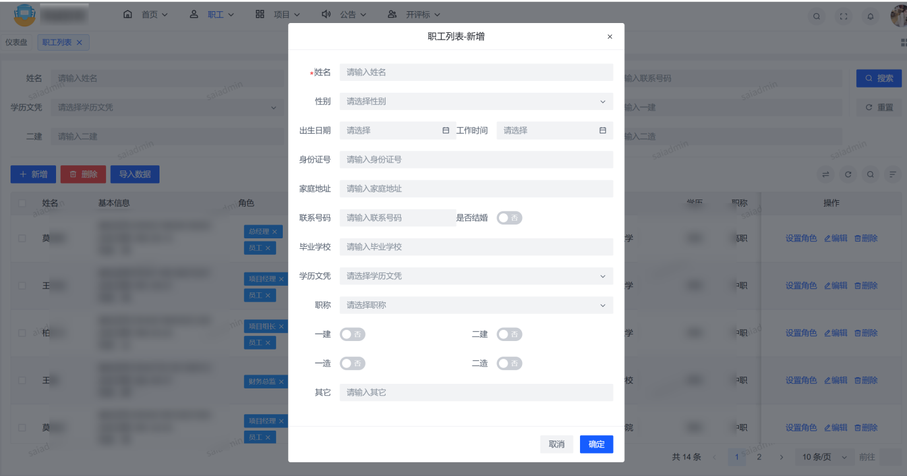

新增职工功能用于将新入职员工的信息录入系统。

## 操作步骤

**打开新增窗口**：点击列表页面上方的蓝色"+
新增"按钮，系统将弹出"职工列表-新增"对话框

**填写基本信息**：按要求填写职工的各项信息，其中姓名为必填项（标记红色\*号）

**设置资质信息**：根据职工实际情况，开启或关闭一建、二建、一造、二造等资质开关

**保存信息**：确认信息填写无误后，点击"确定"按钮保存；如需取消，点击"取消"按钮

## 字段说明

  -----------------------------------------------------------------------
  **字段名称**          **是否必填**      **说明**
  --------------------- ----------------- -------------------------------
  姓名                  是                职工姓名

  性别                  否                男/女

  出生日期              否                职工的出生日期

  工作时间              否                入职日期

  身份证号              否                18位身份证号码

  家庭地址              否                详细家庭住址

  联系号码              否                手机号码

  是否结婚              否                婚姻状况开关

  毕业学校              否                毕业院校名称

  学历文凭              否                学历等级

  职称                  否                专业技术职称

  一建/二建/一造/二造   否                资质证书开关

  其它                  否                备注信息
  -----------------------------------------------------------------------

# 编辑职工信息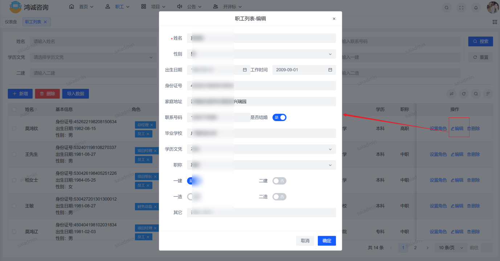
当职工信息发生变化时，可通过编辑功能更新系统中的记录。

## 操作步骤

**选择目标职工**：在职工列表中找到需要编辑的职工记录

**打开编辑窗口**：点击该行右侧的"编辑"链接，系统将弹出"职工列表-编辑"对话框

**修改信息**：在弹出的编辑窗口中修改需要更新的字段内容

**保存修改**：点击"确定"按钮保存修改；点击"取消"按钮放弃修改

## 注意事项

• 编辑窗口会预填充该职工的现有信息，可直接在原有基础上修改

• 身份证号等重要信息修改需谨慎，建议核对无误后再保存

• 资质信息的变更（如一建、二建等）需及时更新，以确保数据准确性

# 设置职工角色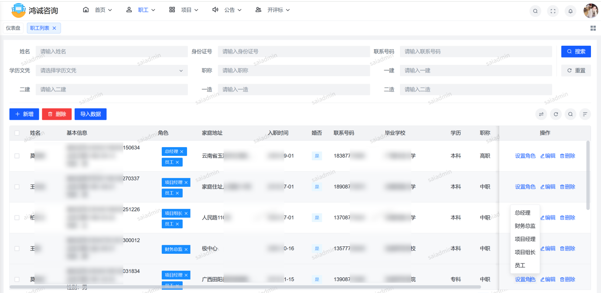

角色设置用于定义职工在系统中的权限级别，不同角色拥有不同的操作权限。

## 系统角色

系统预设以下角色供选择：

  -----------------------------------------------------------------------
  **角色名称**          **权限说明**
  --------------------- -------------------------------------------------
  总经理                拥有系统最高权限，可管理所有模块

  财务总监              负责财务相关模块的管理和审批

  项目经理              负责项目管理和团队协调

  项目组长              负责小组内部任务分配和进度跟踪

  员工                  普通员工权限，可查看和编辑个人信息
  -----------------------------------------------------------------------

## 操作步骤

**选择目标职工**：在职工列表中找到需要设置角色的职工记录

**打开角色设置**：点击该行右侧的"设置角色"链接

**选择角色**：在弹出的下拉菜单中选择需要分配的角色

**确认设置**：角色选择后立即生效，系统会自动保存设置

## 角色组合

一个职工可以同时拥有多个角色。例如，某职工可以同时是"项目经理"和"员工"。设置多个角色时，该职工将拥有所有角色的权限合集。

# 删除职工

删除功能用于将离职或不再需要的职工信息从系统中移除。

## 操作步骤

**选择目标职工**：在职工列表中找到需要删除的职工记录

**执行删除**：点击该行右侧的"删除"链接

**确认删除**：系统会弹出确认对话框，点击"确定"确认删除，点击"取消"放弃操作

## 注意事项

• 删除操作不可恢复，请谨慎操作

• 建议先确认该职工无关联的业务数据（如项目、任务等）后再删除

• 如需保留历史记录，可考虑将职工状态设置为"离职"而非直接删除

# 批量导入职工信息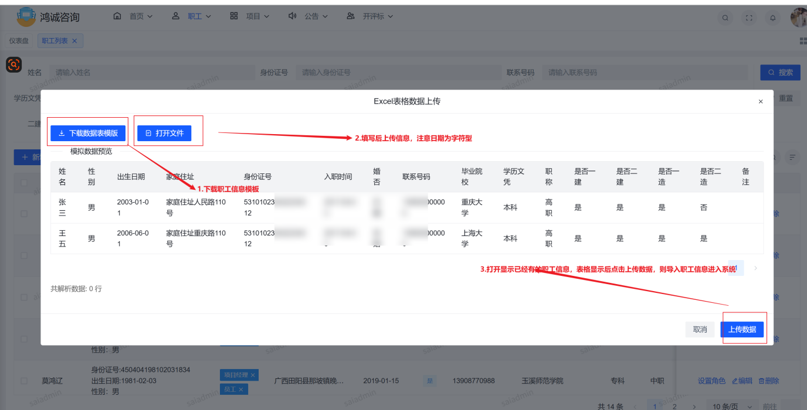

批量导入功能用于一次性导入大量职工信息，适用于新员工入职批量录入场景。

## 操作流程

**下载模板**：点击"导入数据"按钮，在弹出的对话框中点击"下载数据表模板"按钮，获取标准Excel模板文件

**填写数据**：按照模板格式填写职工信息。注意：日期字段需使用文本格式

**上传文件**：点击"打开文件"按钮，选择填写好的Excel文件

**预览确认**：系统会显示数据预览，检查数据是否正确解析

**完成导入**：确认无误后，点击"上传数据"按钮完成导入

## 模板字段说明

  -------------------------------------------------------------------------------
  **字段名称**              **说明**
  ------------------------- -----------------------------------------------------
  姓名                      职工姓名（必填）

  性别                      男/女

  出生日期                  格式：YYYY-MM-DD

  家庭住址                  详细地址

  身份证号                  18位身份证号码

  入职时间                  格式：YYYY-MM-DD

  婚否                      是/否

  联系号码                  手机号码

  毕业院校                  学校全称

  学历文凭                  本科/专科/硕士等

  职称                      专业技术职称

  是否一建/二建/一造/二造   是/否

  备注                      其他补充信息
  -------------------------------------------------------------------------------

## 注意事项

• 请严格按照模板格式填写，不要修改表头名称或顺序

• 日期格式在excel中为字符型，注意统一为：YYYY-MM-DD（如2024-01-15）

• 导入前请确保身份证号等关键信息准确无误

# 招标项目立项

招标项目立项是整个招投标流程的起点，由公司在职员工账号录入项目相关信息，建立项目档案。

## 项目列表 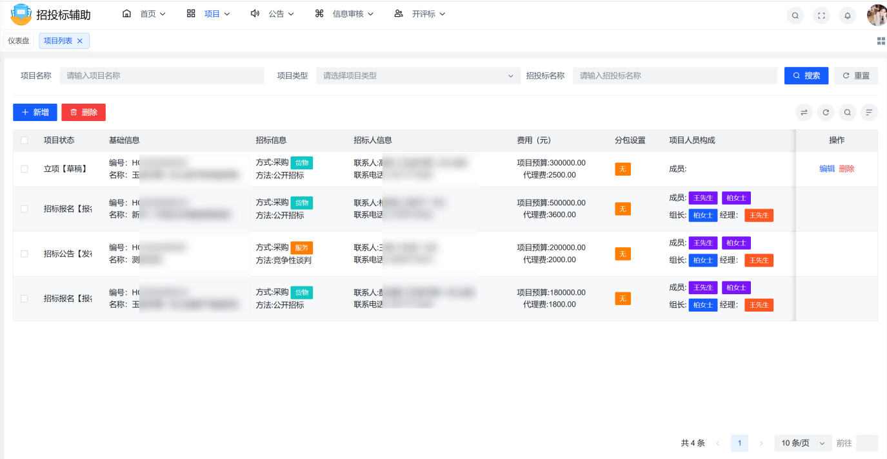

进入"项目"菜单下的"项目列表"页面，可以查看所有已创建的项目。项目列表以表格形式展示，包含以下信息列：

> •
> 项目状态：显示项目当前所处阶段，如立项【草稿】、立项【待审核】、招标报名、招标公告等
>
> • 基础信息：包括项目编号和项目名称
>
> • 招标信息：显示招标方式（工程/服务/货物）和采购方法
>
> • 招标人信息：显示联系人及联系电话
>
> • 费用：显示项目预算和代理费金额
>
> • 分包设置：显示是否有分包
>
> • 项目人员构成：显示项目成员、组长和经理

页面提供搜索功能，可通过项目名称、项目类型、招投标名称进行筛选查询。

## 新增项目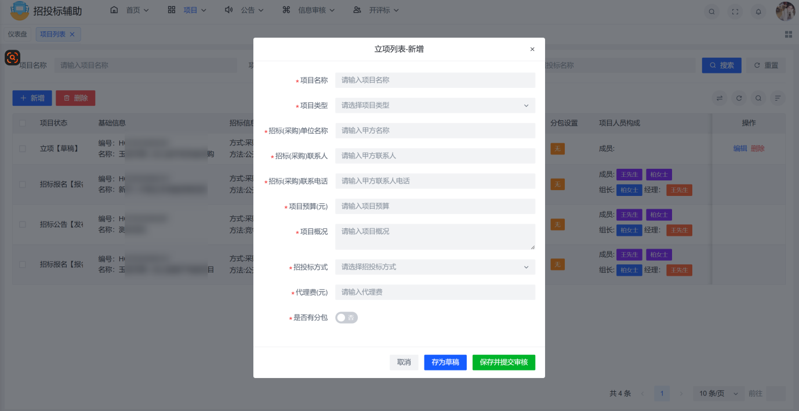

点击"新增"按钮，弹出"立项列表-新增"对话框，填写以下项目信息：

  -----------------------------------------------------------------------
  **字段名称**           **说明**
  ---------------------- ------------------------------------------------
  项目名称               输入项目的完整名称

  项目类型               选择项目类型：工程、服务、货物

  招标(采购)单位名称     输入甲方单位名称

  招标(采购)联系人       输入甲方联系人姓名

  招标(采购)联系电话     输入甲方联系人电话

  项目预算(元)           输入项目预算金额

  项目概况               输入项目的基本情况和需求描述

  招投标方式             选择招标或采购方式

  代理费(元)             输入代理费金额或收费标准

  是否有分包             选择是否分包
  -----------------------------------------------------------------------

填写完成后，可选择"存为草稿"保存当前进度，或点击"保存并提交审核"直接进入审核流程。

## 编辑项目信息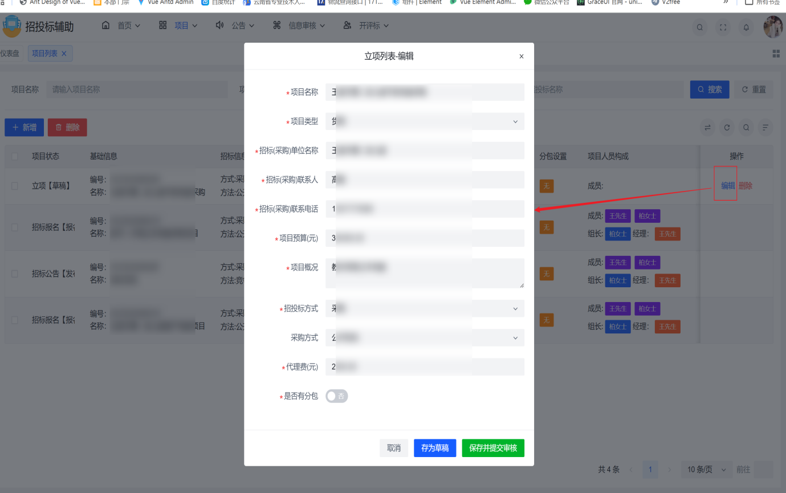

在项目列表中，点击操作列的"编辑"链接，可打开"立项列表-编辑"对话框修改项目信息。编辑界面与新增界面类似，所有字段均可修改。修改完成后同样可选择保存为草稿或提交审核。

# 项目立项审核与分配

项目立项审核与分配是项目立项后的关键环节，由项目经理对项目进行审核，并分配项目组成员。该功能需要登录者有项目经理角色才可以使用。

## 项目分配列表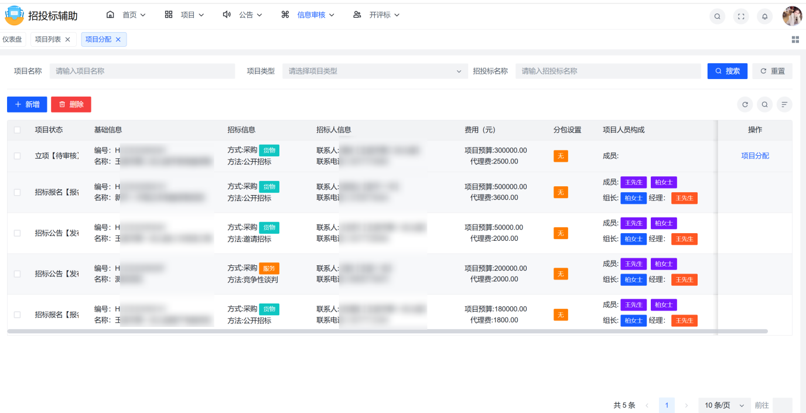

进入"信息审核"菜单下的"项目分配"页面，显示所有待审核和已审核的项目。项目状态为"立项【待审核】"的项目可以进行分配操作。

## 分配成员到项目

点击操作列的"项目分配"链接，弹出"项目管理设置"对话框，包含以下设置项：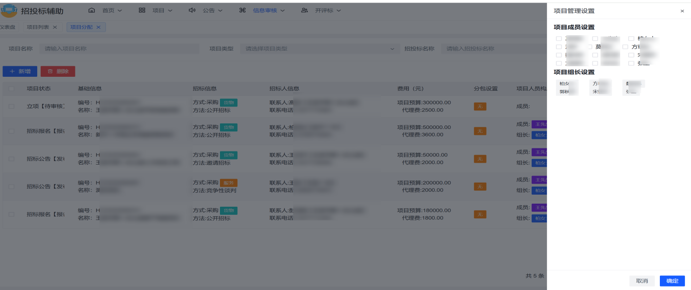{width="6.254861111111111in"
height="2.6284722222222223in"}

### 项目成员设置

通过勾选方式选择参与该项目的成员，可多选。

### 项目组长设置

从下拉列表中选择项目组长，组长负责项目的整体协调和标书审核工作。

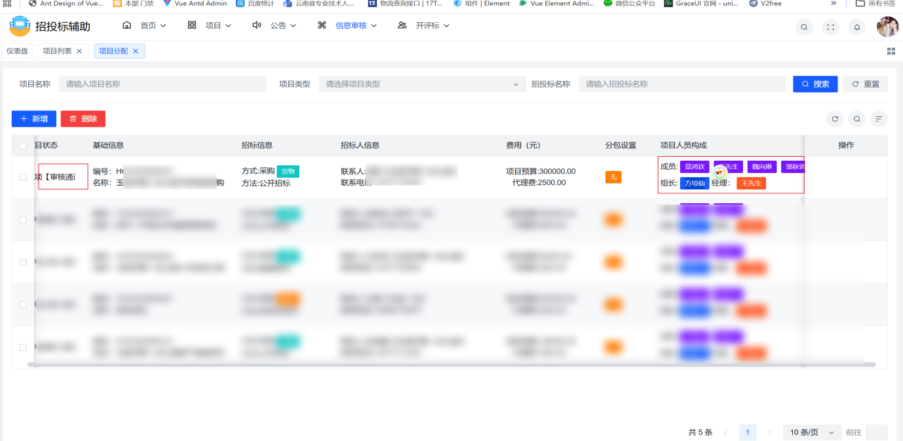

设置完成后点击"确定"按钮，项目状态将更新为"立项【审核通过】"，并在项目人员构成列显示已分配的成员和组长信息。

# 标书编辑与上传审核

项目立项审核通过后，项目组成员可以开始编制招标文件并上传至系统进行审核。该功能需要登录者有项目组长角色才可以使用。

## 标书列表 

进入"标书"菜单下的"标书列表"页面，显示所有已创建的标书。列表包含项目状态、基础信息、招标信息、招标人信息、费用、分包设置、标书名称等信息。

点击"标书编辑"按钮，可以编辑或新增项目标书。

## 新增项目标书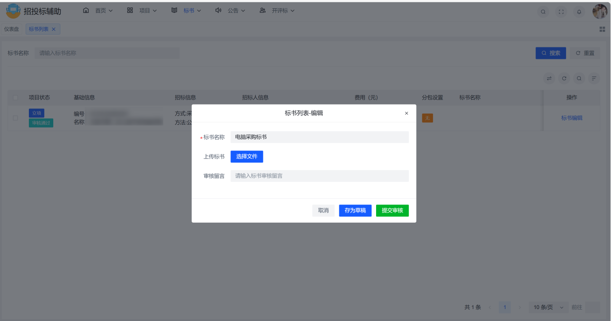

点击"标书编辑"按钮后，弹出"标书列表-编辑"对话框，填写以下内容：

> • 标书名称：输入标书名称，如"电脑采购标书"
>
> • 上传标书：点击"选择文件"按钮，上传Word格式的招标文件
>
> • 审核留言：填写审核留言，如"第一版标书，请审查"

填写完成后，可选择以下操作：

> • 取消：放弃当前操作，关闭对话框
>
> • 存为草稿：保存当前标书信息，状态为"草稿"，可后续修改
>
> • 提交审核：提交标书进行审核，状态变为"待审核"

## 标书提交审核

标书保存为草稿后，可以在标书列表中点击"查看标书"按钮在线预览已上传的标书文档，确认无误后点击"标书编辑"按钮，在编辑对话框中点击"提交审核"按钮，将标书提交给项目经理审核。

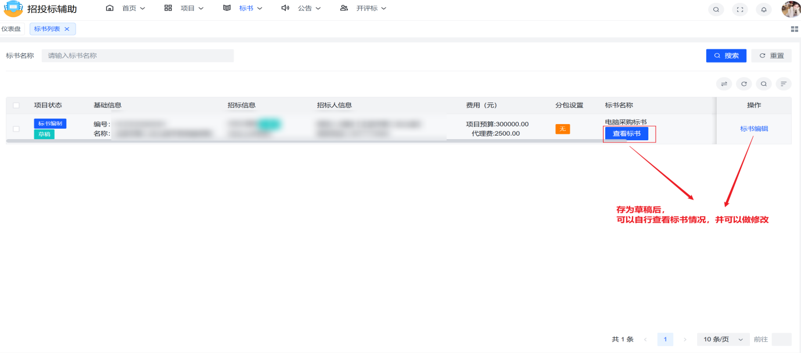

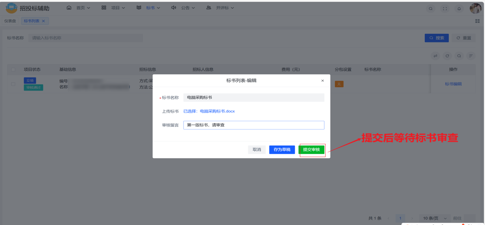

提交审核后，系统会显示"提交后等待标书审查"的提示，标书状态变为"待审核"。

# 标书审核

标书审核由项目经理或指定审核人员执行，对项目组成员提交的标书进行审查，确保标书内容符合招投标规范要求。该功能需要登录者有项目经理角色才可以使用。

## 标书审核列表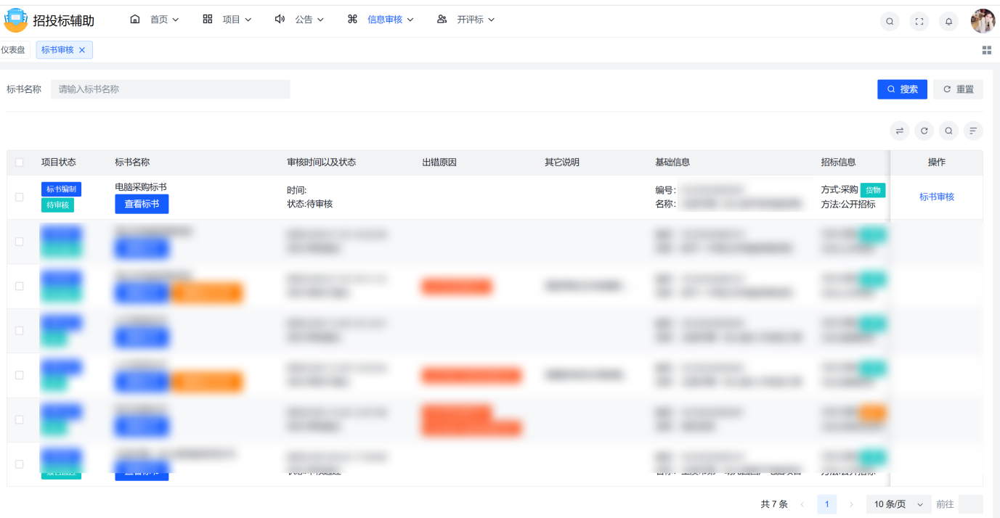

进入"信息审核"菜单下的"标书审核"页面，显示所有待审核和已审核的标书。列表包含以下信息：

> • 项目状态：显示项目当前阶段
>
> • 标书名称：显示标书名称，可点击查看标书
>
> • 审核时间以及状态：显示提交时间和当前审核状态
>
> • 出错原因：如审核不通过，显示不通过原因
>
> • 其它说明：显示审核补充说明
>
> • 基础信息和招标信息：显示项目基本信息

## 审核流程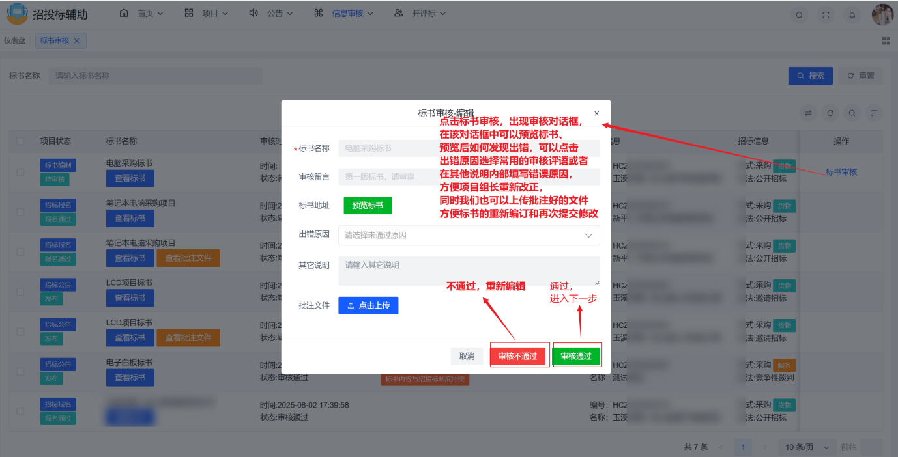

点击操作列的"标书审核"链接，弹出"标书审核-编辑"对话框，审核人员可以进行以下操作：

### 预览标书

点击"预览标书"按钮，可以在线查看标书内容，检查标书格式和内容是否正确。

### 选择出错原因

如发现标书存在问题，可从下拉列表中选择出错原因，如"标书内容与招投标制度冲突"、"标书内容范围不对"等。

### 填写其它说明

在"其它说明"文本框中填写详细的审核意见，如"请在2月5日之前再次提交"。

### 上传批注文件

如有需要，可点击"点击上传"按钮上传批注后的标书文件，方便项目组成员根据批注进行修改。

### 审核决定

审核完成后，点击相应按钮完成审核：

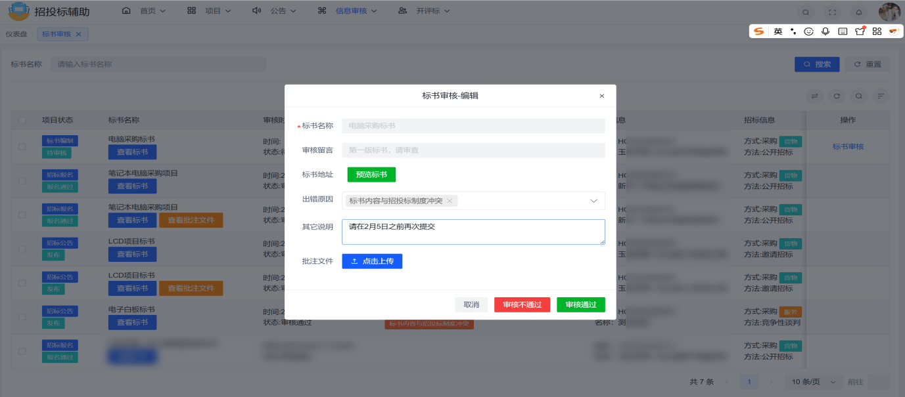

> • 审核不通过：标书退回修改，项目组成员需要根据审核意见修改后重新提交
>
> 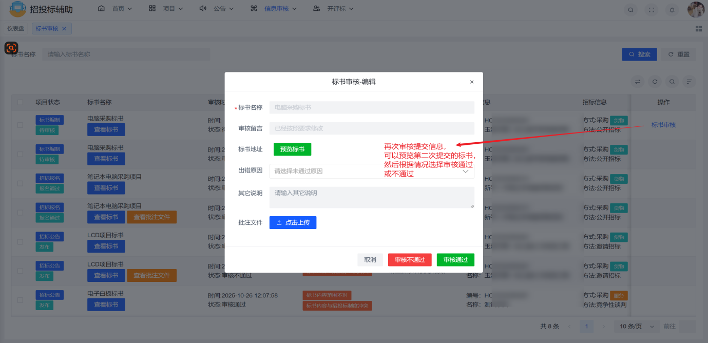
>
> • 审核通过：标书审核通过，进入下一步流程

# 标书评语管理

标书评语管理用于维护审核评语库，便于审核人员快速选择常用的审核意见，提高审核效率。该功能需要登录者有项目经理角色才可以使用。

## 评语列表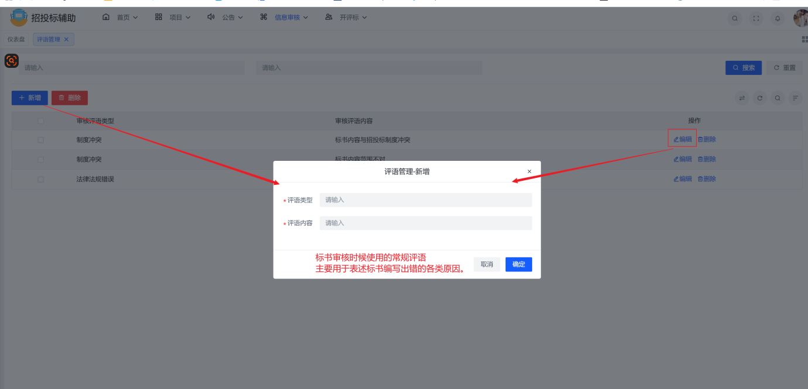

进入"信息审核"菜单下的"评语管理"页面，显示所有已配置的审核评语。列表包含以下信息：

> • 审核评语类型：评语分类，如"制度冲突"、"法律法规错误"等
>
> • 审核评语内容：具体的评语内容

## 新增评语

点击"新增"按钮，弹出"评语管理-新增"对话框，填写以下内容：

> • 评语类型：输入评语分类名称
>
> • 评语内容：输入具体的评语内容

点击"确定"按钮保存评语，该评语将在标书审核时出现在出错原因下拉列表中。

## 编辑和删除评语

在评语列表中，点击操作列的"编辑"链接可以修改评语内容，点击"删除"链接可以删除该评语。

评语管理功能使审核工作更加规范化和标准化，避免了审核意见的重复录入，提高了审核效率。

# 招标公告管理

招标公告管理是发布招标信息的核心模块，项目组成员在此编辑公告内容、预约开标场地、设置相关费用，并提交审核。

## 招标公告列表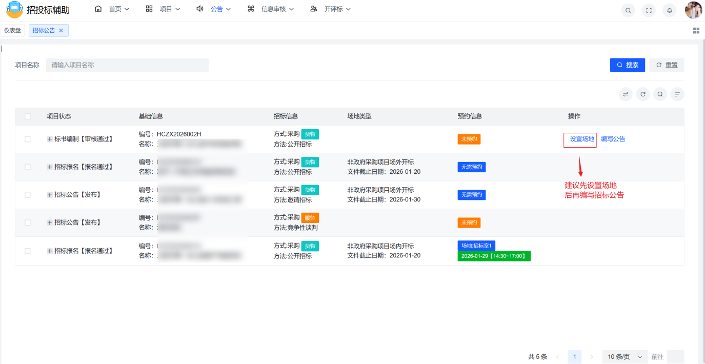

进入"公告"菜单下的"招标公告"页面，可以查看所有招标公告。列表以表格形式展示，包含以下信息列：

> •
> 项目状态：显示项目当前所处阶段，如标书编制【审核通过】、招标公告【草稿】、招标公告【发布】、招标报名【报名通过】等
>
> • 基础信息：包括项目编号和项目名称
>
> •
> 招标信息：显示招标方式（采购/工程/服务）和采购方法（公开招标、邀请招标、竞争性谈判等）
>
> • 场地类型：显示开标场地类型和文件截止日期
>
> • 预约信息：显示预约的场地和开标时间
>
> • 操作：提供设置场地、编写公告、取消场地、提交审核、发布公告等功能按钮

页面提供搜索功能，可通过项目名称进行筛选查询。

## 场地预约设置

## 

在招标公告列表中，点击"设置场地"按钮，弹出"预约场地"对话框，进行场地预约设置。

### 选择场地类型

系统提供以下场地类型选项：

> • 非政府采购项目场内开标：需要预约开标时间和开标场地
>
> • 非政府采购项目场外开标：无需预约时间和场地
>
> • 政府采购项目场内开标：需要预约开标时间和开标场地
>
> • 公共交易中心开标：在公共资源交易中心进行开标

### 场内开标设置

### 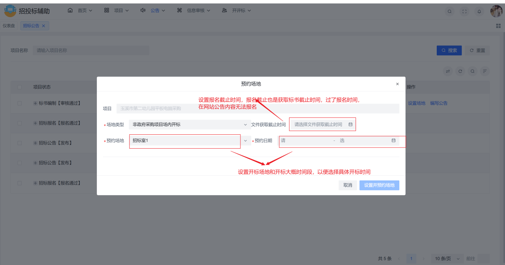

选择"场内开标"类型后，需要设置以下信息：

> • 文件获取截止时间：设置报名截止时间，超过此时间在网站公告内容无法报名
>
> • 预约场地：选择开标场地，如"招标室1"
>
> • 预约日期：选择开标日期范围

### 预约开标时间

### 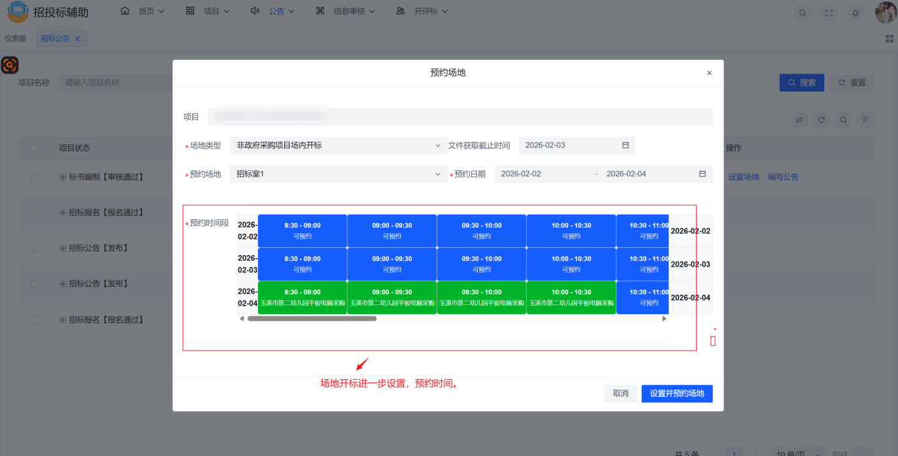

设置场地和日期后，系统显示日历式时间选择界面，以30分钟为一个时间段。蓝色表示"可预约"，绿色表示已被本项目预约的时间段。点击相应时间段即可完成预约。

### 取消场地预约

### 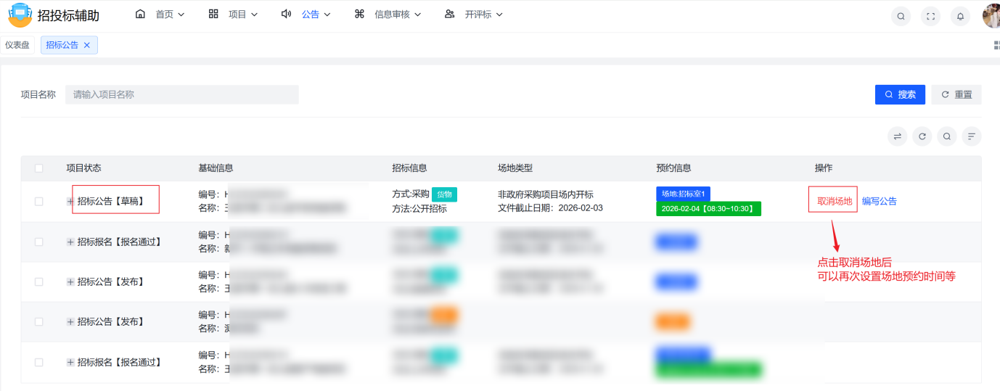
如需修改场地预约信息，可在列表中点击"取消场地"按钮，取消后可以再次设置场地预约时间。

## 编写招标公告

## 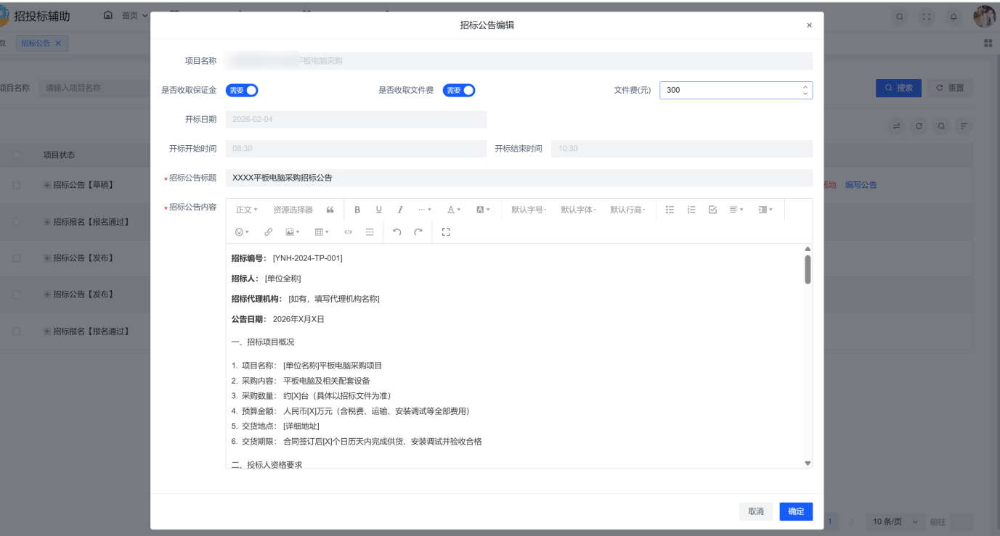

点击"编写公告"按钮，弹出"招标公告编辑"对话框，编辑公告内容。

### 费用设置

在公告编辑页面顶部，可以设置以下费用信息：

> • 是否收取保证金：开启后需要缴纳投标保证金
>
> • 是否收取文件费：开启后需要填写文件费金额（如300元）

### 开标时间设置

系统自动带入已预约的开标日期和时间段，显示开标开始时间和结束时间。

### 公告内容编辑

公告编辑采用富文本编辑器，包含以下主要内容：

> • 招标公告标题：如"XXXX平板电脑采购招标公告"
>
> • 招标编号：系统自动生成或手动填写
>
> • 招标人：填写招标单位全称
>
> • 招标代理机构：填写代理机构名称
>
> • 公告日期：发布公告的日期
>
> •
> 招标项目概况：包括项目名称、采购内容、采购数量、预算金额、交货地点、交货期限等
>
> • 投标人资格要求：列出投标人需要满足的资格条件和证明材料

编辑完成后，点击"确定"按钮保存公告内容。

### 提交审核

### 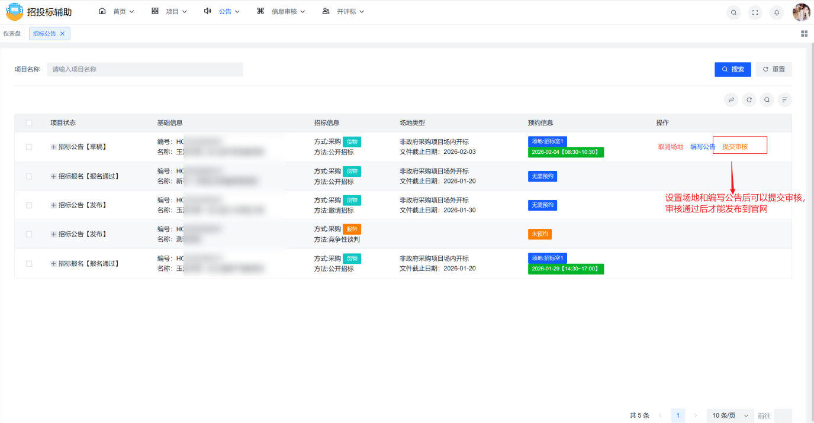

设置场地和编写公告后，点击"提交审核"按钮，将招标公告提交给项目经理审核。审核通过后才能发布到官网。

# 招标公告审核

招标公告审核由项目经理执行，对项目组成员提交的招标公告进行审查，确保公告内容准确无误后发布。

## 审核列表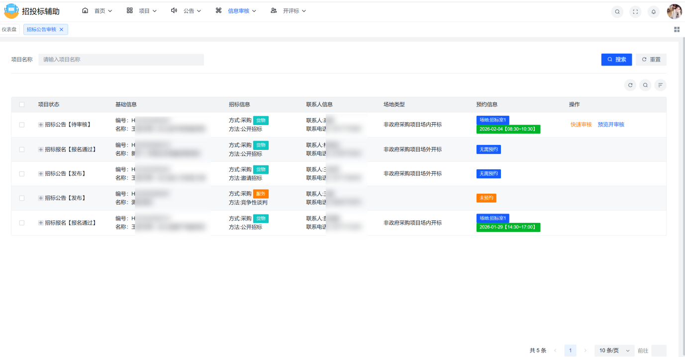

进入"信息审核"菜单下的"招标公告审核"页面，显示所有待审核和已审核的招标公告。列表包含以下信息：

> • 项目状态：显示"招标公告【待审核】"等状态
>
> • 基础信息：项目编号和名称
>
> • 招标信息：招标方式和采购方法
>
> • 联系人信息：显示联系人及联系电话
>
> • 场地类型和预约信息
>
> • 操作：提供"快速审核"和"预览并审核"功能

## 审核流程

点击"预览并审核"链接，打开"公告预览"页面，审核人员可以进行以下操作：

### 预览公告内容

### 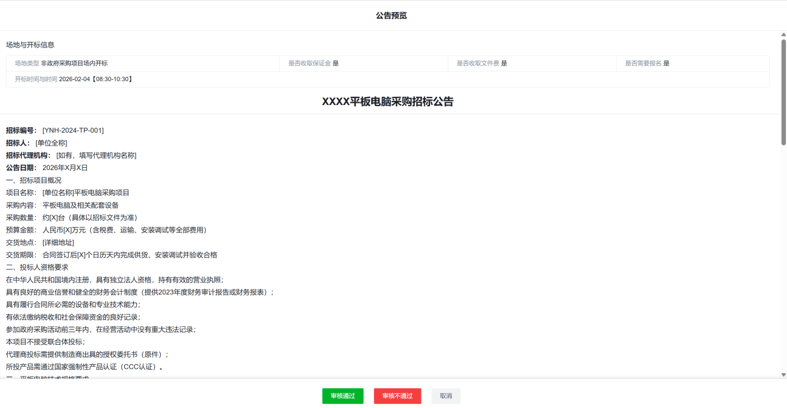

预览页面显示完整的公告内容，包括：

> •
> 场地与开标信息：场地类型、是否收取保证金、是否收取文件费、是否需要报名、开标时间与地点
>
> • 公告正文：完整的招标公告内容

### 审核决定

审核完成后，点击相应按钮完成审核：

> • 审核通过：公告审核通过，可以发布到官网
>
> • 审核不通过：公告退回修改
>
> • 取消：关闭预览页面

### 发布公告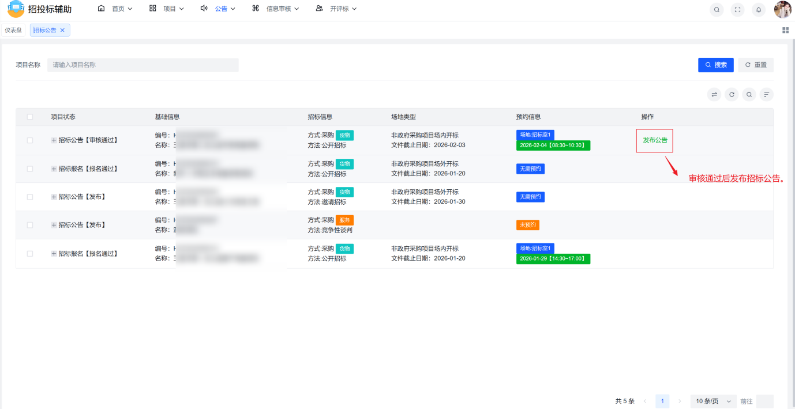

审核通过后，在招标公告列表中点击"发布公告"按钮，公告将同步发布到公司官网。用户角色可以操作。

# 开标室管理

开标室管理用于维护公司可用的开标场地信息，便于项目预约开标场地。

## 场地列表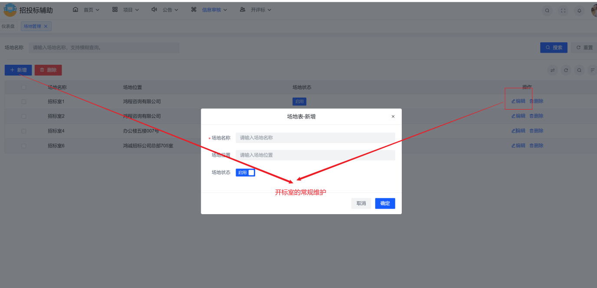
进入"信息审核"菜单下的"场地管理"页面，显示所有已配置的开标室。列表包含以下信息：

> • 场地名称：如"招标室1"、"招标室2"等
>
> • 场地位置：显示场地所在位置
>
> • 场地状态：显示"启用"或"停用"状态
>
> • 操作：提供"编辑"和"删除"功能

## 新增场地

点击"新增"按钮，弹出"场地表-新增"对话框，填写以下内容：

> • 场地名称：输入开标室名称
>
> • 场地位置：输入场地所在位置
>
> • 场地状态：勾选"启用"或取消勾选停用

点击"确定"按钮保存场地信息。

## 编辑和删除场地

在场地列表中，点击操作列的"编辑"链接可以修改场地信息，点击"删除"链接可以删除该场地。

# 官网信息展示

招标公告审核通过后，会自动同步到公司官网，供投标人查看和报名。

## 首页公告列表

## 

公司官网首页展示公司的业务数据和新发布的招标公告。页面包含以下内容：

> •
> 业务统计：显示业务服务年限、累计完成代理项目数量、累计招标代理金额等数据
>
> •
> 公告分类：包括招标公告、变更公告、中标候选人、中标结果、异常公告等标签页
>
> • 公告列表：显示最新发布的招标公告，标注"NEW"标识

## 公告详情页

点击公告标题进入公告详情页，显示完整的招标公告内容，包括：

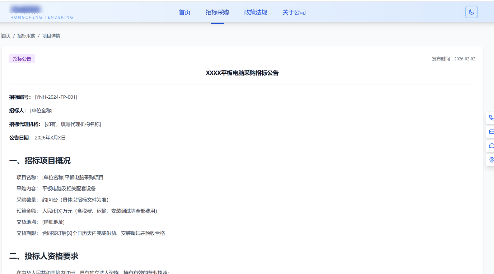

> • 公告标题和发布时间
>
> • 招标编号、招标人、招标代理机构、公告日期
>
> •
> 招标项目概况：项目名称、采购内容、采购数量、预算金额、交货地点、交货期限
>
> • 投标人资格要求
>
> • 联系人信息：联系人、电话、手机、邮箱、监督电话
>
> •
> 附件清单：投标函格式、法定代表人授权书、报价明细表、技术规格偏离表、商务条款偏离表、售后服务承诺书、近三年类似业绩证明表、资格证明文件要求
>
> • 备注信息

页面底部提供"返回"按钮返回列表，以及"我要报名"按钮进行项目报名。

# 投标报名管理

投标报名管理用于处理投标人在公司官网提交的报名信息，项目组成员审核通过后，系统自动向投标人发送定稿招标文件。

## 投标人报名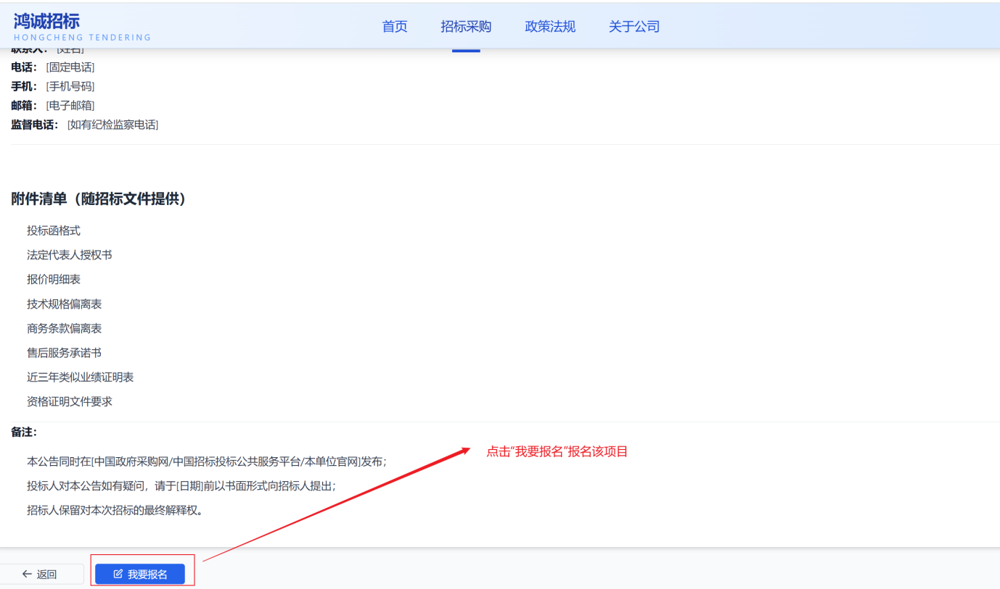

投标人在公司官网查看招标公告后，点击"我要报名"按钮，填写报名信息并上传资质文件。

### 填写企业信息

### 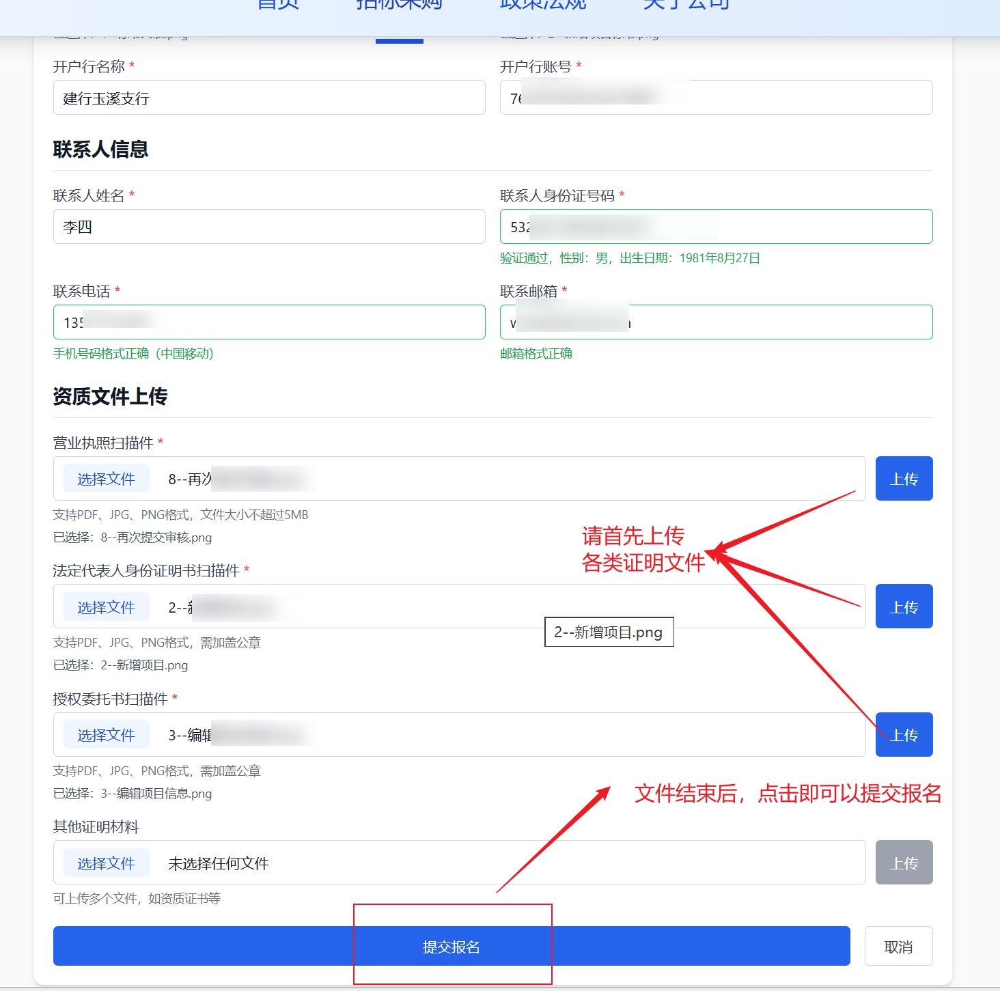

报名页面需要填写以下企业信息：

> • 企业名称
>
> • 统一信用代码
>
> • 法定代表人姓名和身份证号码
>
> • 开户行名称和账号

### 填写联系人信息

需要填写以下联系人信息：

> • 联系人姓名
>
> • 联系人身份证号码（系统自动验证，显示性别和出生日期）
>
> • 联系电话（系统自动验证手机号格式和运营商）
>
> • 联系邮箱（系统自动验证邮箱格式）

### 上传资质文件

需要上传以下证明材料（支持PDF、JPG、PNG格式）：

> • 营业执照扫描件（必填，文件大小不超过5MB）
>
> • 法定代表人身份证明书扫描件（必填，需加盖公章）
>
> • 授权委托书扫描件（必填，需加盖公章）
>
> • 其他证明材料（可选，如资质证书等）

文件上传完成后，点击"提交报名"按钮完成报名。报名信息将保存到管理系统。

## 报名信息审核

进入"信息审核"菜单下的"报名信息审核"页面，显示所有项目的报名信息。列表包含以下信息：

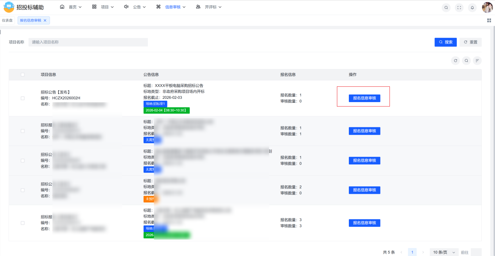

> • 项目信息：项目编号、名称、状态
>
> • 公告信息：公告标题、场地类型、报名截止时间和场地预约信息
>
> • 报名信息：报名数量和审核数量
>
> • 操作："报名信息审核"按钮
>
> **审核报名企业**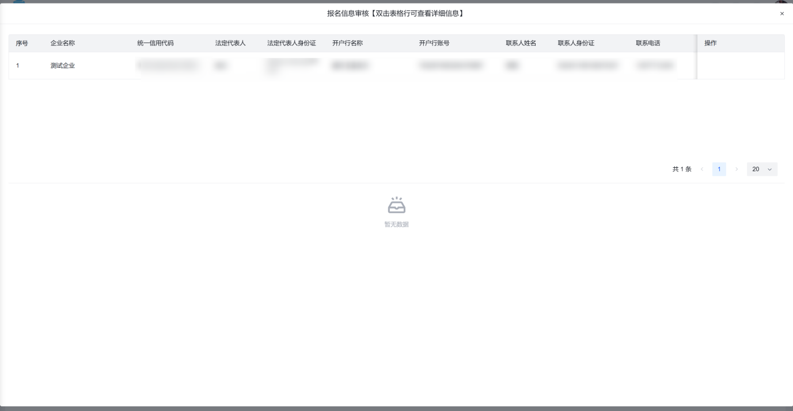
点击"报名信息审核"按钮，打开"报名信息审核"对话框，显示报名企业列表。列表包含：序号、企业名称、统一信用代码、法定代表人、法定代表人身份证、开户行名称、开户行账号、联系人姓名、联系人身份证、联系电话。

双击表格行可以查看报名详细信息，包括：

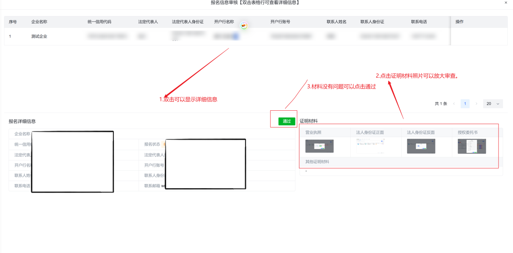

> •
> 报名详细信息：企业名称、统一信用代码、法定代表人、开户行名称、开户行账号、联系人姓名、联系人身份证、联系电话、联系邮箱、报名状态
>
> •
> 证明材料：营业执照、法人身份证正面、法人身份证反面、授权委托书、其他证明材料的扫描件预览

### 审核操作

审核人员可以进行以下操作：

> • 点击证明材料照片可以放大审查
>
> • 材料没有问题可以点击"通过"按钮完成审核

审核通过后，系统根据项目是否收取文件费进行不同处理：

> •
> 收取文件费的项目：报名信息转到财务人员账号审核费用到账情况，审核通过后邮箱自动向投标人发送定稿招标文件
>
> • 不收取文件费的项目：审核通过后邮箱自动向投标人发送定稿招标文件

报名时间截止后，系统可生成报名情况汇总表（PDF/Excel/Word格式）

# 评标准备

该模块用于在开标前准备评标所需的各类辅助文件，包括导入评标专家信息、设置开标基本信息、导出各类签到表等。

# 评标准备列表

# 

评标准备列表是评标前数据准备的入口页面，项目组成员在此查看所有待评标项目，并进行相关准备工作。

## 进入评标准备页面

点击顶部导航栏的"开评标"菜单，选择"评标准备"子菜单，进入评标准备列表页面。

## 列表信息展示

评标准备列表以表格形式展示项目信息，包含以下列：

> • 基础信息：显示项目编号和项目名称
>
> •
> 场地类型：显示开标场地类型（如"非政府采购项目场内开标"、"非政府采购项目场外开标"等）和文件截止日期
>
> • 预约信息：显示预约的开标场地和开标时间（如"场地:招标室1
> 2026-02-04【08:30-10:30】"）
>
> • 专家信息：显示是否已导入评标专家信息（"无"表示未导入）
>
> • 投标单位：显示报名参与投标的单位数量（如"1家单位"、"3家单位"）

## 操作按钮

每行项目提供以下操作按钮：

> • 导入专家：点击打开导入专家库对话框，导入评标专家信息
>
> • 导出数据：下拉菜单，可选择导出各类评标辅助表格
>
> • 信息设置：点击打开信息设置对话框，填写开标基本信息

页面顶部提供项目名称搜索框，可通过输入项目名称进行筛选查询。

# 导入评标专家

# 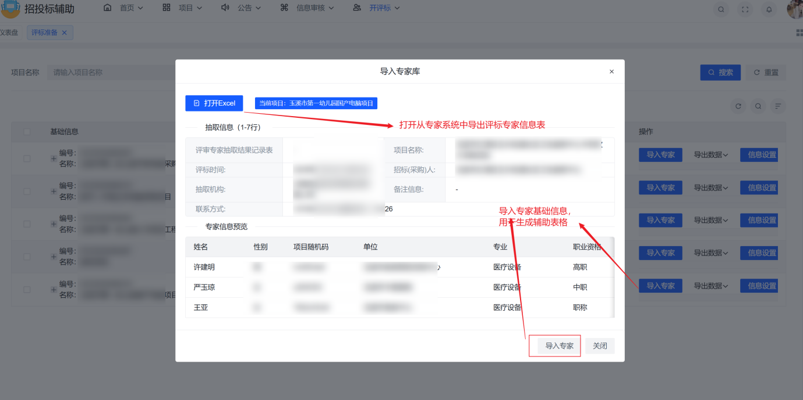

导入评标专家功能用于将专家库系统中抽取的评标专家信息导入到本系统，用于生成评标相关的辅助表格。

## 打开导入专家对话框

在评标准备列表中，点击项目行操作列的"导入专家"按钮，弹出"导入专家库"对话框。

## 导入专家信息

导入专家库对话框包含以下功能区域：

### 打开Excel文件

点击"打开Excel"按钮，选择从专家系统中导出的评标专家信息表Excel文件。系统会自动解析文件内容。

### 抽取信息预览

Excel文件导入后，系统显示"抽取信息（1-7行）"预览区域，包含以下信息：

> • 评审专家抽取结果记录表
>
> • 项目名称
>
> • 评标时间
>
> • 招标(采购)人
>
> • 抽取机构
>
> • 备注信息
>
> • 联系方式

### 专家信息预览

系统以表格形式展示导入的专家信息，包含以下字段：

> • 姓名：专家姓名
>
> • 性别：专家性别
>
> • 项目随机码：专家抽取的随机码
>
> • 单位：专家所属单位
>
> • 专业：专家专业领域
>
> • 职业资格：专家职业资格（如高职、中职、职称等）

### 确认导入

确认专家信息无误后，点击"导入专家"按钮完成导入。导入成功后，专家信息将用于生成评标委员会成员签到表等辅助文件。点击"关闭"按钮可取消导入操作。

# 设置开标基本信息

设置开标基本信息功能用于填写开标相关的基本信息，这些信息将用于生成各类评标辅助表格。

## 打开信息设置对话框

## 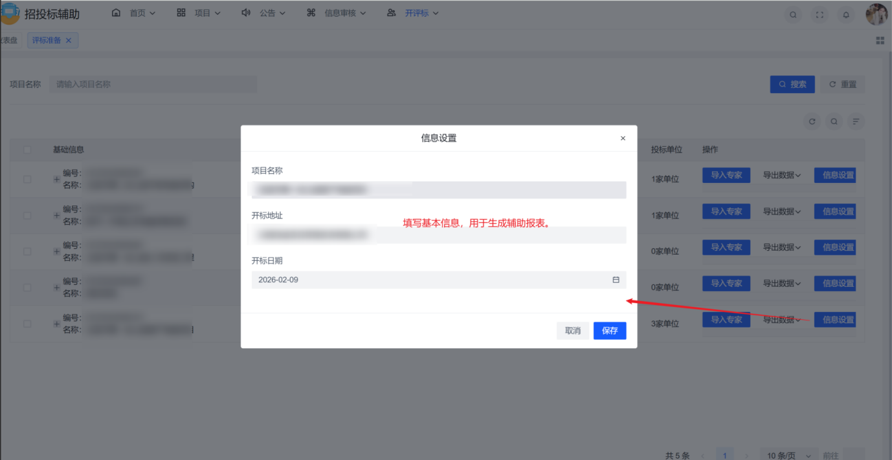

在评标准备列表中，点击项目行操作列的"信息设置"按钮，弹出"信息设置"对话框。

## 填写基本信息

信息设置对话框包含以下填写项：

> • 项目名称：系统自动带入当前项目名称，可修改
>
> • 开标地址：填写开标地点的详细地址
>
> • 开标日期：选择开标日期，格式为YYYY-MM-DD

填写完成后，点击"保存"按钮保存信息，或点击"取消"按钮放弃修改。保存后的信息将用于生成各类签到表和声明书。

# 导出评标辅助表格

导出评标辅助表格功能用于生成开标评标所需的各类签到表和声明书，方便现场管理。

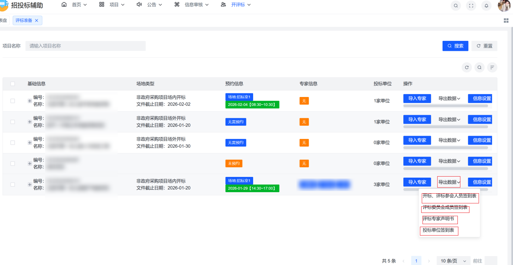

## 签到表类型说明

系统支持导出以下四类评标辅助表格：开标、评标参会人员签到表

### 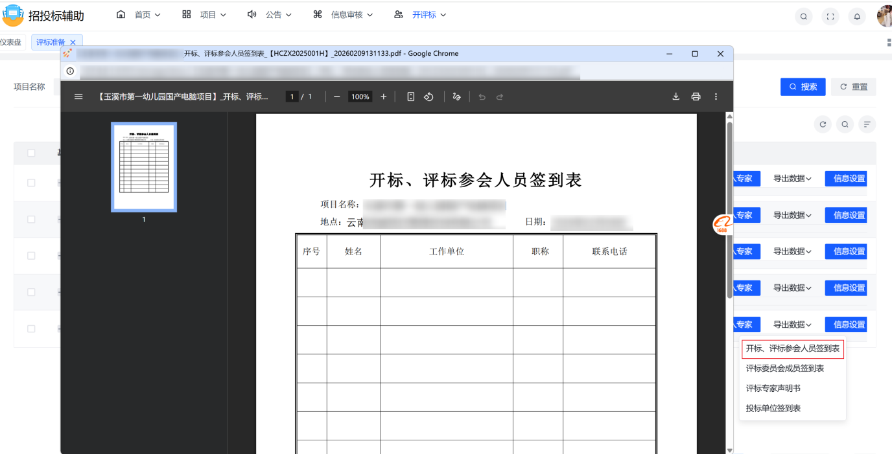

用于记录所有参加开标、评标会议的人员签到信息。表格包含以下字段：

> • 序号
>
> • 姓名
>
> • 工作单位
>
> • 职称
>
> • 联系电话

### 评标委员会成员签到表

### 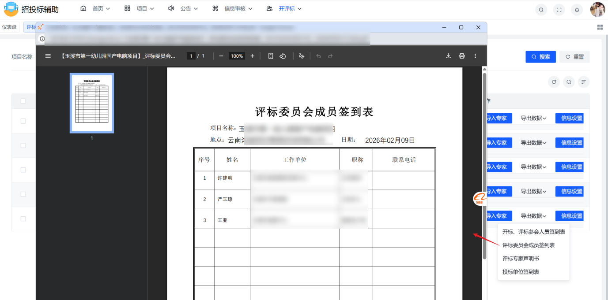

用于记录评标委员会成员的签到信息。表格自动带入已导入的专家信息，包含以下字段：

> • 序号
>
> • 姓名
>
> • 工作单位
>
> • 职称
>
> • 联系电话

### 评标专家声明书

用于评标专家签署声明，确认遵守评标纪律和回避原则。

### 投标单位签到表

### 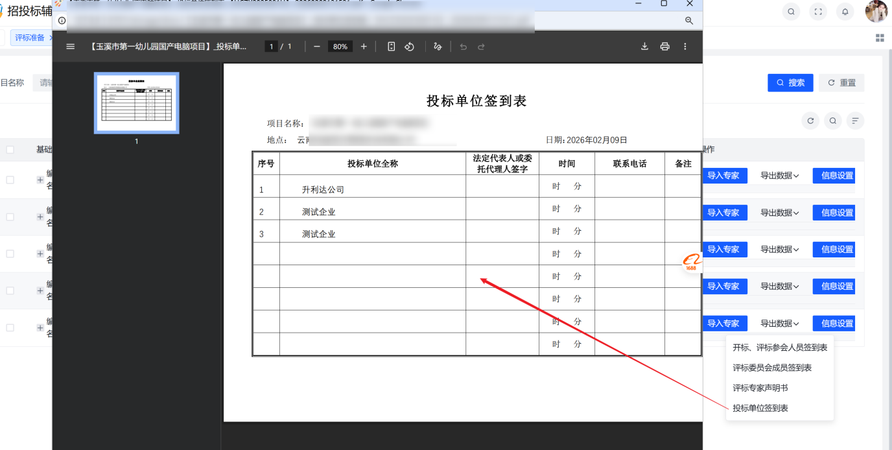
用于记录投标单位的签到信息。表格自动带入已报名的投标单位信息，包含以下字段：

> • 序号
>
> • 投标单位全称
>
> • 法定代表人或委托代理人签字
>
> • 时间（时/分）
>
> • 联系电话
>
> • 备注

## 导出操作步骤

导出评标辅助表格的操作步骤如下：

**选择项目**：在评标准备列表中找到需要导出表格的项目

**点击导出数据**：点击项目行操作列的"导出数据"下拉按钮

**选择表格类型**：在下拉菜单中选择需要导出的表格类型

**查看导出文件**：系统自动生成PDF格式的表格文件并在浏览器中打开预览

**下载或打印**：在PDF预览页面可进行下载保存或直接打印

导出的PDF文件命名格式为：【项目名称】\_表格类型\_【项目编号】\_时间戳.pdf，方便识别和管理。

建议在开标前提前导出所有需要的辅助表格，并进行打印准备，确保开标评标工作顺利进行。
